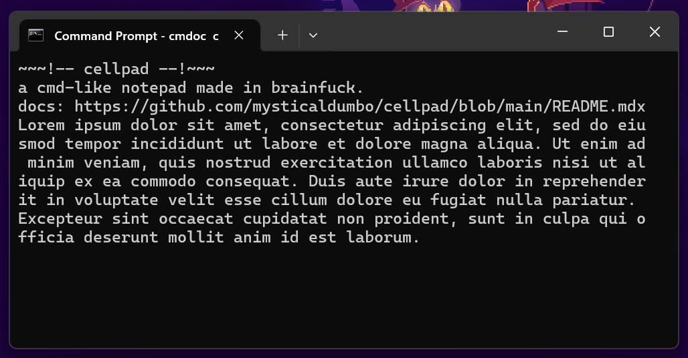

# cellpad
a "notepad" made in brainfuck.
## run:
> [!NOTE]
> this example is using **my** brainfuck parser. you can download it [here.](https://www.github.com/mysticaldumbo/bf-tools)
```bash
git clone https://github.com/mysticaldumbo/cellpad.git
cd cellpad
bf main.bf
```
## disclamers
becuase this was made in brainfuck, it is a very limited notepad. once you enter a line, you can't change it. you can't save files, or import. this was simply just made for the hell of it. feel free to just mess around with it and have fun.


^ photo taken with flameshot.
